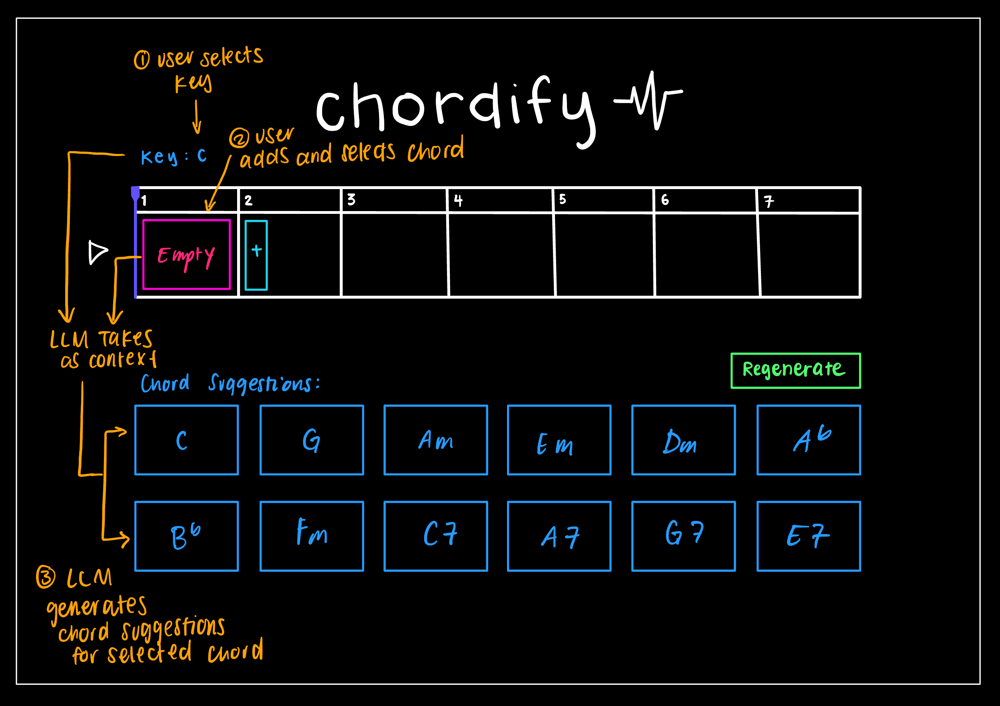
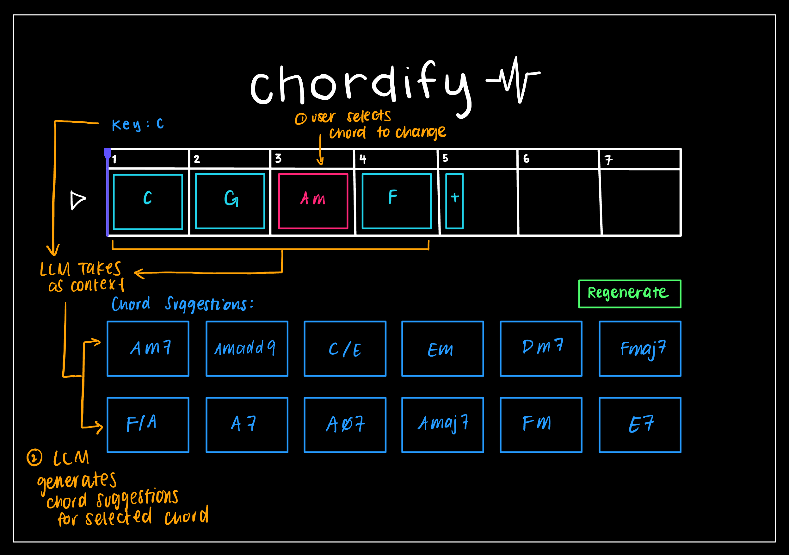
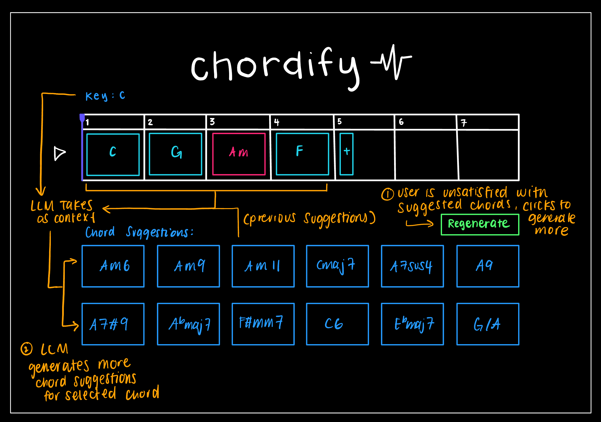

# Suggest Chord
## Original Concept Specification
```
concept ProgressionBuilder

purpose 
    help users find harmonious chords quickly

principle
    the user sets the key of the progression, can add or delete chords from progression, and receives suggestions for chords at any specified position in the progression.

state
    a progression Progression with
        a key String, the musical key of the progression
        a sequence of chords Chord, each with a string corresponding with a musical chord or null to represent no chord has been selected for this slot

actions
    setKey(progression, key):
        effect sets the key of progression to key

    addSlot(position: Number):
        requires position is a valid index of Chords or position is undefined
        effect if position is undefined, adds a null chord at the end of the progression; otherwise, adds a null chord at the given position in the progression
    
    addChord(position: Number, chord: String):
        requires position is a valid index of Chords
        effect sets the chord at the given position to the given chord
    
    removeSlot(position: Number):
        requires position is a valid index of Chords
        effect removes the chord at the given position

    removeChord(position: Number):
        requires position is a valid index of Chords
        effect sets chord to null at the given position

    suggestChords(progression, position: Number): (list of chords)
        requires position is a valid index of Chords
        effect returns a list of suggested chords to put in position of the Chords, taking into account the key and the chords before and after it
```
## AI-augmented Concept Specification
```
concept ProgressionBuilder

purpose 
    help users find harmonious chords quickly

principle
    the user sets the key of the progression, can add or delete chords from progression, and receives suggestions for chords at any specified position in the progression from an LLM given the context of the chord.

state
    a progression Progression with
        a key String, the musical key of the progression
        a sequence of chords Chord, each with a string corresponding with a musical chord or null to represent no chord has been selected for this slot

actions
    setKey(progression, key):
        effect sets the key of progression to key

    addSlot(position: Number):
        requires position is a valid index of Chords or position is undefined
        effect if position is undefined, adds a null chord at the end of the progression; otherwise, adds a null chord at the given position in the progression
    
    addChord(position: Number, chord: String):
        requires position is a valid index of Chords
        effect sets the chord at the given position to the given chord
    
    removeSlot(position: Number):
        requires position is a valid index of Chords
        effect removes the chord at the given position

    removeChord(position: Number):
        requires position is a valid index of Chords
        effect sets chord to null at the given position

    suggestChords(progression, position: Number): (list of chords)
        requires position is a valid index of Chords
        effect returns a list of suggested chords to put in position of the Chords, generated by an LLM given the context of the chord.
```
## User Interaction
 <br>
 <br>
 <br>

The user selects a key of their choice, C major, then adds a the first starting chord slot. They select the slot and observe the LLM generated suggestions for starting chord of the progression. After hearing the suggestions, they decide to start the progression with C major. They add more slots, observe the LLM generated suggestions for each slot, and select the chord they want to use. They end up with the following progression: C major, G major, A minor, F major. Feeling that the progressions is too commonplace, they click on the third slot holding the chord A minor, and observe the LLM generated suggestions for replacing the chord at that position. Still not satisfied with the suggestions given, the user clicke 'Regenerate' to get a new back of 12 chords to listen to. After listening to the new suggestions, they decide to replace the chord at the third slot with Am11, liking the dreamy feel the chord adds to the progression. Satisfied with their chord progression, they were able to use LLM powered chord suggestion to quickly iterate through chord progressions and find one that they liked.

## Test Cases
### 1. Starting Chord
Show AI-powered chord suggestions for the starting chord of a progression, given no context other than the key.
```javascript
const progressionBuilder = new ProgressionBuilder();
progressionBuilder.setKey('B major');
progressionBuilder.addSlot();
await progressionBuilder.suggestChords(llm, 0);
```
### 2. Next Chord
Shows AI-powered chord suggestions for the next chord of a progression, given the context of the previous chords and key.
```javascript
const progressionBuilder = new ProgressionBuilder();
progressionBuilder.setKey('A minor');
progressionBuilder.addSlot();
progressionBuilder.addChord(0, 'Am');
progressionBuilder.addSlot();
await progressionBuilder.suggestChords(llm, 1);
```
### 3. Middle Chord
Shows AI-powered chord suggestions for the chord at a specified position of a progression, given the context of the previous chords and following chords and key.
```javascript
const progressionBuilder = new ProgressionBuilder();
progressionBuilder.setKey('A minor');
progressionBuilder.addSlot();
progressionBuilder.addChord(0, 'Am');
progressionBuilder.addSlot();
progressionBuilder.addChord(1, 'Dm');
progressionBuilder.addSlot();
progressionBuilder.addChord(2, 'F');
await progressionBuilder.suggestChords(llm, 1);
```
## Prompt Variants
### Starting Prompt
You are an expert harmony assistant specializing in Western tonal music (pop, rock, folk, and classical).
Your task is to suggest chords that fit harmonically within a given chord progression and key. Focus on common, simple chords rather than complex or extended jazz chords.

**INPUT INFORMATION:**  
Key: \<progression.key\>  
Progression: \<progression.chords\>  
Position: \<position\>

The chord progression is written using standard music notation (e.g., "C", "Am", "F", "G", or null if a slot is empty).
The key defines the tonal center for the harmonic context.  
There may be multiple empty slots (null values) in the progression.  
The chord at the specified Position may or may not already be filled — provide suggestions anyway, ignoring the current chord at that position.

**YOUR TASK:**  
Return \<NUM_SUGGESTIONS\> musically coherent chord suggestions, ordered from most to least preferred for that position in this progression and key.

**GUIDELINES:**
- Output must be a JSON object.
- Use standard chord notation: "Cmaj7", "Am7b5", "E7", "F#dim", "G9", etc.
- Each chord should make sense in the context of the given key and surrounding chords.
- You may include both diatonic chords (from the key) and non-diatonic chords (e.g. secondary dominants, borrowed chords, tritone substitutions).
- The ordering should reflect musical likelihood or smoothness of progression (voice leading and harmonic function).
- Avoid duplicates and overly complex symbols (e.g. "C13#11b9").
- Assume 12 semitone equal temperament and common Western harmony.

**OUTPUT FORMAT:**  
{
    "chordSuggestions": ["list of NUM_SUGGESTIONS chords in standard music notation"]
}
Output only valid JSON, no extra text, no markdown, no trailing commas.

### 1. More standard starting chords
For the first test case, the suggestions were giving unstandard chords to start the progression. The output of the original prompt for starting a progression in B major was:
```json
"E7", "F#m", "G#m", "A", "B", "C#m", "D#m7b5", "F#7", "C7", "G7", "D7", "E"
``` 
I thought that it was weird that the root was the fifth suggestion instead of the first, and that the many unstable chords were suggested. I added a special case to the prompt to specifically suggest more stable and standard chords for the first chord of the progression.

**SPECIAL CASES:**
- If Position = 0 (the first chord of the progression), suggest the most common *starting chords* used in songs in that key. 
  - Prioritize the tonic (I), dominant (V), and subdominant (IV) chords, as well as their simple variants (e.g., Imaj7, IVmaj7, V7, vi).
  - Avoid unstable or tension-heavy chords (e.g., diminished, secondary dominants, or borrowed chords) unless they are common openers in that style.
  - The list should reflect what real songs often begin with in that genre (e.g., pop, rock, folk, classical), not theoretical possibilities.

The LLM suggested the following chords for starting a progression in B major with the modified prompt: 
```json
"B", "Bmaj7", "F#", "F#7", "E", "Emaj7", "G#m", "C#m", "D#m", "B6", "G#m7", "C#m7"
```

These are much more standard chords to start a progression with.

### 2. Balance between simple and complex chords
I had the orginal prompt instructions to focus more on simple chords, but I found that most of the chords generated were had little extension, at the most a seventh. I wanted to add in a little more complexity, while still having simple options in the mix. I modified the prompt to "Focus on a natural blend of common triads and expressive extensions (maj7, add9, sus2/sus4, 6, 9, and 7 chords)." For the second test case, this was the old result compared to the original result:

Original Result:
```json
"E7", "G", "C", "Am", "F", "Dm", "Em", "Cmaj7", "G7", "E", "Bdim", "A7"
```

New Result:
```json
"E7", "G", "C", "F", "E", "Dm7", "G7", "Am7", "E7sus4", "Cmaj7", "Fmaj7", "G"
```
Mildly better, but still not what I was looking for. There is one interesting chord thrown in here, but much of the suggestions are the same. I will have to try different prompts that balance complexity and simplicity. Perhaps the point later in the guidelines to avoid complexness makes the model value simplicity still over complexity.

### 3. Generating chord variations
For the case of replacing a chord in the progression, I think it would be cool if the LLM suggested variations on the chord (added extensions, altered quality, etc.) instead of simply suggesting different chords. I added this modification to the prompt:

**FILLED POSITION HANDLING:**
- If the chord at the specified Position is already filled (not null), first suggest variations of that chord. Variations can include:
    - Common extensions (ex. 7, maj7, 6, 9)
    - Suspended versions (ex. sus2, sus4, 7sus4)
    - Added notes (ex. add9)
    - Inversions or slash chords (e.g., G/B, C/E)
    - Modal mixtures or borrowed flavors if common in pop, rock, folk, classical
- After listing variations, you may suggest other harmonically compatible chords in the key. About half of the suggestions should be derived from the original chord.

Here are the results on the third test case.

Original Result:
```json
"C", "Dm", "Em", "G", "Am", "F", "E7", "D7", "Am7", "Fmaj7", "G7", "Dm7"
```

New Result:
```json
"G", "G7", "Gadd9", "G6", "Gmaj7", "Em", "Am", "Dm", "Bdim", "D7", "C", "F"
```

This worked really well! The model suggested a mix of variations on the original chord and other chords that fit well in the progression, making it easy for the user to iterate on a chord they may have already liked.

## Validators
This first issue is that the LLM could return invalid JSON, in which case we would be unable to extract the chords. We validate this by making sure the text returned is a valid JSON and contains the fields we want through a regex match. The second issue could be the LLM returning chords that are not in standard music notation. We validate this by checking each chord is in \<root\>\<quality\>\<extension\> format. The third issue could be the LLM not returning the correct number of chords. We can check for this when the JSON is parsed to ensure the resulting chordSuggestions array is exactly NUM_SUGGESTIONS. 